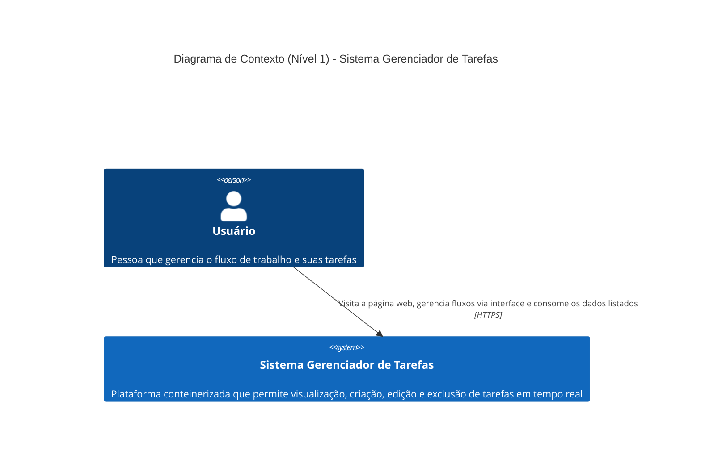
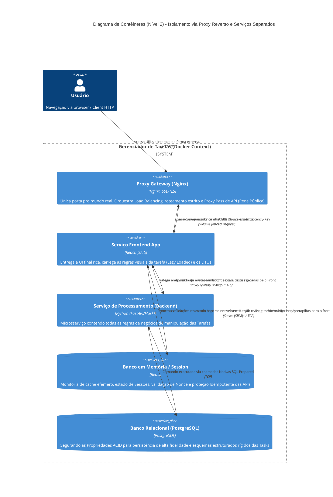
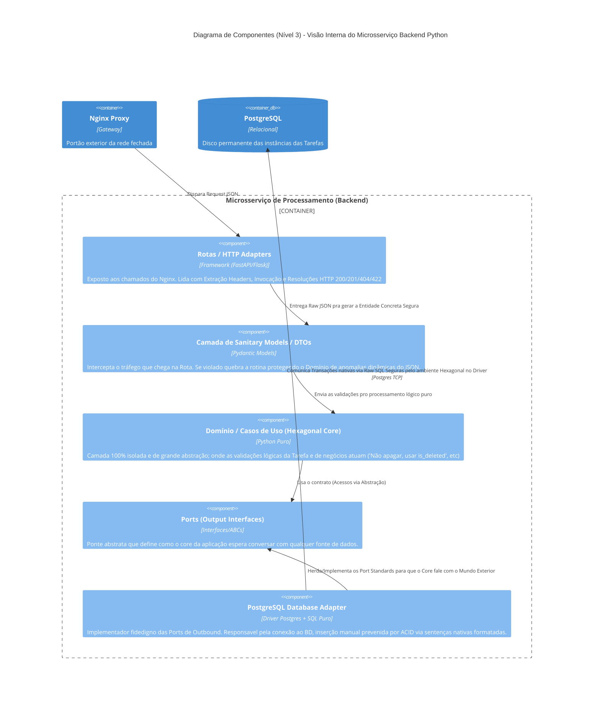
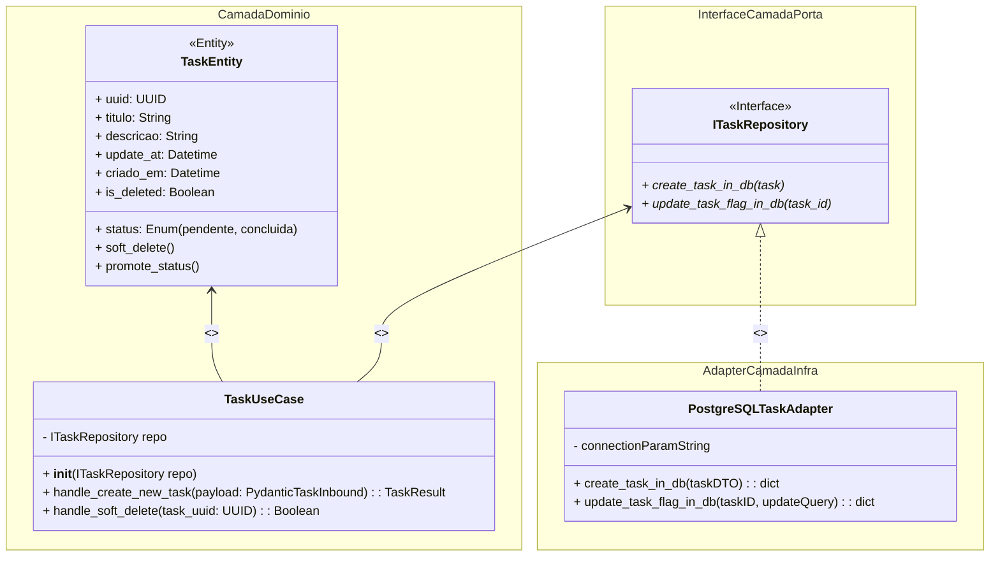

# Arquitetura C4 Model (C4-PlantUML/Mermaid)

Este documento centraliza visualmente as decisões de engenharia arquitetural usando o Nível C4 de abstração para aprofundar e materializar o fluxo, com a sintaxe do *Mermaid*.

---

## 1. Nível 1: Diagrama de Contexto (Context)
*Visão macro de como o usuário final enxerga e interage com todo o sistema, sem visualizar divisões técnicas internas.*

---

## 2. Nível 2: Diagrama de Contêineres (Containers)
*Evidenciando toda a infraestrutura física/lógica mapeada no Docker (O Frontend, o Proxy Gateway, o Backend e os Bancos PostgreSQL/Redis).*

---

## 3. Nível 3: Diagrama de Componentes (Components)
*Um mergulho "Zoom-In" abrindo o Contêiner do **Backend (Python)** detalhando seus módulos internos baseados na Arquitetura Hexagonal adotada.*

---

## 4. Nível 4: Diagrama de Código (Code - Class Strategy)
*O menor nível do C4 foca na estrutura das Classes/Code do domínio no Python em si, materializando O PORQUÊ do Padrão da Arquitetura Hexagonal proteger nossas premissas nativas.*

